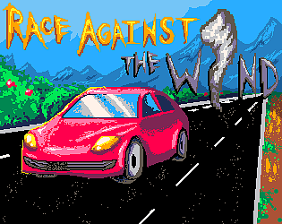

# About Me
I'm a student at Rider University studying Game and Interactive Media Design. I also work with the university as a tutor in the Writing Studio.

I am passionate about the artistic side in games as I believe that a distinctive style and strong narrative are the things that make a game stand out. I have talents in multiple areas, including illustration, character design, writing, programming, and I recently started producing songs in Ableton Live 12. 

# Projects
I have experience in Python, HTML, GDScript, and Unreal Blueprints. Listed below are the games I have published. 

## PICO-8
### [Race Against the Wind](https://yumesimulation.itch.io/race-against-the-wind)

A submission for Rider University's Annual 48-Hour Game Jam. It is an endless runner game where you avoid obstacles and a tornado with ever-increasing speed. I created the cover, sprites, animation, and assisted in parts of coding. 

This was my first time partaking in a game jam, and it was both a lot of fun and a learning experience. I worked with a small team under the pressure of limited time, which we had to carefully manage. Although relatively simple, I am proud of what we accomplished and I look forward to joining more game jams in the future for the experience.

## Godot
### [Poster Girl: Empty Rooms](https://yumesimulation.itch.io/poster-girl-empty-rooms)

A 2D puzzle game demo made for my class final. It is an escape-room type of game where the protagonist, Poster Girl, has to look for clues in a surreal environment to find out where she is and escape. 

This was my first experience as a solo developer, and I wanted to use elements from a personal project since I was given the chance to depict it and bring some of it to fruition. Creating this vertical slice gave me a lot of insight on independant workflow for a big project, and now that some of it is public, I want to keep working on it to expand it. 
